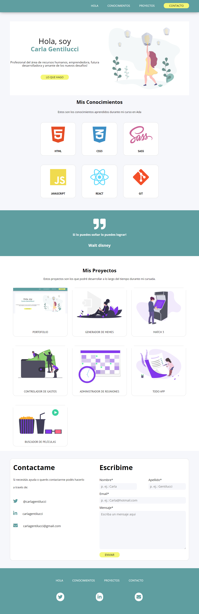

#Portafolio de Ada

###Este proyecto fue realizado como nuestro primer trabajo de entrega con los conocimientos adquiridos del Modulo 1 de Ada

<br>

### Si quieres ver como me quedo puedes darle click a este enlace [enlace](https://github.com/carlagentilucci/portafolio-carla-gentilucci.git)

<br>

### Si quieres tener el código en tu computadora deberás seguir estos pasos en tu terminal.

-Ir al [repositorio] (https://github.com/carlagentilucci/portafolio-carla-gentilucci.git )
-Darle click al botón de forkear
-Darle click al boton de code
-Copiar la url
-Abrir tu terminal y poner el comando de ````git clone <https://github.com/carlagentilucci/portafolio-carla-gentilucci.git>````
-Entrar a la carpeta del proyecto y abrirlo en tu IDE

### Este proyecto no necesita la instalación de ninguna dependencia por ahora

<br>

###Este deberia ser el resultado final de tu instalacion 




###Este portafolio fue desarrollado por las chicas de la cursada 6 de Ada
<br>

###Quisiera agradecer especialmente a mi querido profesor Jonh Parra y a mi querida compañera Natalia como así también a todas mis compañeras por el grupo tan lindo que tenemos a pesar de las distancias


###De Carla con ♥